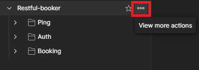
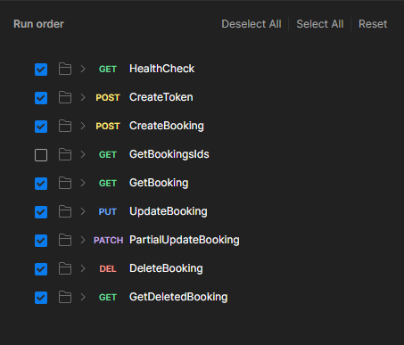

# Restful-booker postman tests

The project includes the collection of tests for Restful-booker service along with necessary evironment variables, ready to be executed in Postman.

For security reasons, it is a good practice to not include login credentials in the text. However, in order to send requests, it is required to fill values in following fields:

`username: admin`  
`password: password123`

## Test runner

To open the collection runner open the collection's menu and click "Run collection":

To run the collection make sure that requests are set as in the following picture (GetBookingsId request ist not mandatory) and click "Run":

